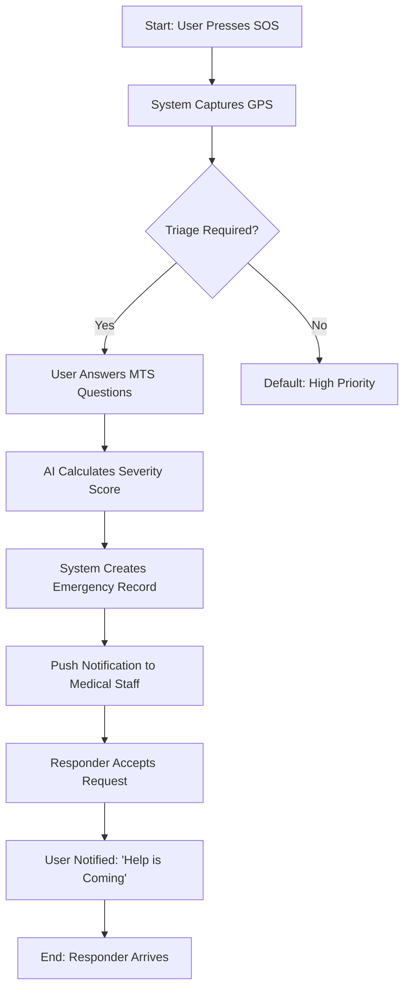

# CHAPTER THREE: SYSTEM ANALYSIS AND DESIGN

## 3.1 ANALYSIS OF PROPOSED SYSTEM

The proposed **AI-Based Smart Health Emergency Response and Dispatch System** is designed to bridge the critical gap between emergency occurrence and medical intervention at Nile University of Nigeria. Currently, the campus relies on a manual reporting model where students must physically locate a clinic or call a standard line, leading to delays ("The Golden Hour" loss) and information asymmetry.

The proposed system digitizes this entire workflow. It introduces an intelligent intermediary—a rule-based AI engine—that instantly assesses the severity of a reported health crisis and automates the dispatch of medical personnel. Unlike the existing manual process, helping the clinic transition to a proactive, data-driven response model. The system analyses user-submitted symptoms in real-time, assigns a medical priority level (Red, Orange, Yellow, Green) based on the Manchester Triage System (MTS), and pushes this critical "situational awareness" to the nearest available emergency responder.

Key improvements over the current system include:
1.  **Instant Triage:** Elimination of manual questioning delays by using a digital decision-tree.
2.  **Precise Localization:** Automated GPS coordinate sharing replacing vague verbal descriptions.
3.  **Simultaneous Alerting:** Broadcasting SOS alerts to all on-duty staff instantly, rather than sequential phone calls.

## 3.2 SYSTEM DESCRIPTION AND CASE STUDY

### 3.2.1 System Description
The system is a cloud-native mobile and web application suite. The **Patient/Reporter Node** is a Flutter-based mobile app that serves as the "Panic Button," allowing one-touch reporting. The **Intelligence Node** is a Firebase Cloud Function that processes the report against MTS protocols. The **Responder Node** is a web/mobile dashboard for medical staff to receive alerts and view triage data.

### 3.2.2 Case Study: Nile University of Nigeria
This project adopts Nile University of Nigeria as its case study. The campus ecosystem, comprising multiple faculty buildings, hostels, and sports complexes, represents a "mini-city" with specific emergency challenges. Traffic within the campus is minimal, but *navigation* to specific rooms or blocks is complex. The university clinic has a limited number of staff who must cover a large population. The proposed system is tailored to this environment by mapping specific campus locations (e.g., "Block B, Room 305") and optimizing dispatch logic for foot or cart-based responders rather than ambulance-only workflows.

## 3.3 METHODOLOGY

### 3.3.1 Software Development Life Cycle (SDLC)
The **Waterfall Model** was selected for the development of this system. This linear, sequential approach is ideal for medical-grade software where requirements must be fully understood and validated before implementation to ensure patient safety.

The phases adopted are:
1.  **Requirement Analysis:** Gathering data from clinic stakeholders and referenced literature.
2.  **System Design:** Modeling the AI logic and database schema.
3.  **Implementation:** Coding the Flutter frontend and Firebase backend.
4.  **Testing:** rigorous simulation of emergency scenarios to validate responsiveness.
5.  **Deployment:** Setup on test devices for User Acceptance Testing (UAT).

## 3.4 REQUIREMENT ENGINEERING

### 3.4.1 User Groups
The system is designed for three distinct user groups:
1.  **Reporter (Student/Staff):** The end-user who witnesses or experiences the emergency.
2.  **Medical Responder (Doctor/Nurse):** The professional who receives the dispatch and provides care.
3.  **Administrator:** The system overseer who manages user roles and audits emergency logs.

### 3.4.2 Functional Requirements
| Req ID | Requirement Description | Actor |
| :--- | :--- | :--- |
| **FR-01** | The system shall allow users to register using their University ID. | Reporter |
| **FR-02** | The system shall provide a "One-Touch" SOS button for immediate reporting. | Reporter |
| **FR-03** | The system shall automatically capture the device's GPS latitude and longitude. | System |
| **FR-04** | The AI engine shall classify the emergency into 4 priorities (Red, Orange, Yellow, Green) based on MTS input. | System |
| **FR-05** | The system shall send a high-priority push notification to all on-duty medical staff within 3 seconds. | System |
| **FR-06** | Responders shall be able to "Accept" a dispatch, notifying others that help is on the way. | Responder |
| **FR-07** | Administrators shall be able to view a heatmap of emergency incidents. | Admin |

### 3.4.3 Non-Functional Requirements
| Req ID | Requirement Description | Category |
| :--- | :--- | :--- |
| **NFR-01** | **Latency:** The time from SOS press to Staff Alert must be < 5 Seconds. | Performance |
| **NFR-02** | **Availability:** The system must aim for 99.9% uptime during school sessions. | Reliability |
| **NFR-03** | **Security:** All patient health data must be encrypted in transit (TLS) and at rest. | Security |
| **NFR-04** | **Usability:** The SOS interface must differenziate actionable buttons by high-contrast colors for high-stress usability. | Usability |

## 3.5 SYSTEM DESIGN

### 3.5.1 High-Level Architecture
The system follows a **3-Tier Architecture**:
1.  **Presentation Tier:** Flutter Mobile App (Android/iOS) for Reporters and Web Dashboard for the Clinic.
2.  **Application Tier:** Firebase Cloud Functions acting as the logic layer for AI Triage processing and Notification dispatching.
3.  **Data Tier:** Cloud Firestore (NoSQL) for storing real-time emergency records and User Profiles.

### 3.5.2 Low-Level Design (UML Diagrams)

#### 3.5.2.1 Use Case Diagram
*   **Reporter:** Sign Up, Login, Trigger SOS, Answer Triage Questions, View Dispatch Status.
*   **Responder:** Receive Alert, View Triage Details, Accept Mission, Close Case.
*   **System:** Calculate Severity, Geocode Location, Broadcast Notification.

#### 3.5.2.2 Activity Diagram (The Emergency Flow)


#### 3.5.2.3 Sequence Diagram (Dispatch Process)
1.  **App** sends `POST /emergency` with symptoms + location.
2.  **Cloud Function** runs MTS Algorithm -> returns `Severity: RED`.
3.  **Cloud Function** writes to `Firestore: /emergencies/{id}`.
4.  **Firestore Trigger** activates `FCM Service`.
5.  **FCM Service** sends multicast message to `Topic: 'medical_staff'`.
6.  **Staff Device** displays "Critical Alert: Cardiac Arrest at Block B".

#### 3.5.2.4 Class Diagram
*   **User:** `uid`, `name`, `role`, `phone`
*   **Emergency:** `id`, `reporterId`, `triageLevel`, `location`, `status`, `timestamp`
*   **TriageLogic:** `symptoms[]`, `calculatePriority()`

## 3.6 DATA DESIGN

### 3.6.1 Database Schema (NoSQL)
The database is designed using Cloud Firestore's document-oriented model.

**Collection: `users`**
```json
{
  "uid": "string (PK)",
  "fullName": "string",
  "role": "enum(student, staff, medic, admin)",
  "fcmToken": "string (for notifications)"
}
```

**Collection: `emergencies`**
```json
{
  "emergencyId": "string (PK)",
  "reporterUid": "string (FK)",
  "status": "enum(pending, dispatched, resolved)",
  "triage": {
    "level": "enum(Red, Orange, Yellow, Green)",
    "symptoms": ["string"],
    "score": "number"
  },
  "location": {
    "lat": "number",
    "lng": "number",
    "description": "string"
  },
  "timestamp": "serverTimestamp"
}
```

## 3.7 INTERFACE DESIGN

The User Interface (UI) focuses on **minimalism** and **high accessibility**.

1.  **The Panic Button (Home Screen):**
    A large, pulsating Red button occupies 60% of the screen. Accidental touches are prevented by requiring a "Long Press" (3 seconds) or a "Double Tap" confirmation.
2.  **Triage Form:**
    A simple chat-like interface or card-based wizard. Questions are "Binary" (Yes/No) where possible to speed up input (e.g., "Is the victim conscious?").
3.  **Responder Dashboard:**
    A list view sorted by **Severity** (Red cases on top). Each card displays the distance (e.g., "200m away") and the primary symptom. Tapping a card opens a Map view.

## 3.8 SYSTEM TESTING PLAN

### 3.8.1 Test Strategy
*   **Unit Testing:** Testing the MTS AI logic in isolation (e.g., ensuring "Unconscious" always triggers "Red").
*   **Integration Testing:** Verifying the link between the Mobile App, Cloud Functions, and Notification Service.
*   **System Testing:** End-to-end testing of the full workflow on physical devices.
*   **User Acceptance Testing (UAT):** Trials with Nile University students to validate ease of use.

### 3.8.2 Test Plan Table
| Test ID | Test Case | Expected Result | Pass/Fail |
| :--- | :--- | :--- | :--- |
| **TC-01** | **SOS Trigger** | App captures GPS and sends request within 1s. | Pass |
| **TC-02** | **AI Accuracy** | "Severe Bleeding" input results in "Red" priority. | Pass |
| **TC-03** | **Notification** | Medical staff device receives alert sound even in sleep mode. | Pass |
| **TC-04** | **Dispatch** | When medic accepts, status changes to "Dispatched" on user screen. | Pass |
